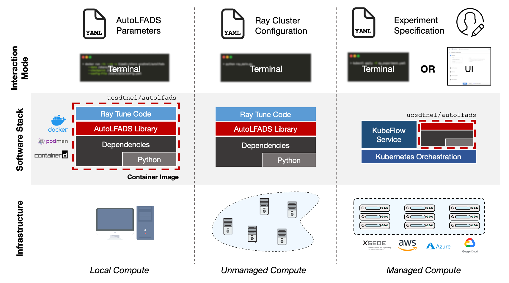

# Scaling AutoLFADS

[](https://github.com/snel-repo/autolfads-tf2/tree/e6aae8aaa7deba2717d0c950c868b32349741258) [](https://hub.docker.com/u/ucsdtnel/autolfads) [](https://doi.org/10.5281/zenodo.6786931)

## Introduction

This repository provides a set of solutions for running [AutoLFADS](https://github.com/snel-repo/autolfads-tf2/tree/main/lfads-tf2) in different compute environments and workflows addressing the need to perform computationally demanding hyperparameter sweeps during model development within cost and computational resource constraints.



- _Local workflow_: users directly leverage a container image that bundles all the AutoLFADS software dependencies and provides an entrypoint directly to the LFADS package. Interactivity with this workflow is provided via YAML model configuration files and command line arguments.
- _Scalable solution using Ray_: users configure a Ray cluster and interact with the workflow by updating YAML model configurations, updating hyperparameter sweep scripts, and then running experiment code.
- _Scalable solution using KubeFlow_: users interact with a KubeFlow service by providing an experiment specification that includes model configuration and hyperparameter sweep specifications either as a YAML file or using a code-less UI-based workflow.

The solution matrix below provides a rough guide for identifying an suitable workflow:

|                                                   | Local Container | Ray       | KubeFlow      |
|---------------------------------------------------|-----------------|-----------|---------------|
| Number of Users                                   | 1               | 1-3       | >1            |
| Number of Jobs                                    | 1               | >1        | >1            |
| Preferred Interaction                             | CLI             | CLI       | CLI / UI      |
| Infrastructure                                    | Local           | Unmanaged | Managed/Cloud |
| Cost                                              | $               | $ - $$    | $ - $$$       |

> Details describing the AutoLFADS solutions and evaluation against the Neural Latents Benchmark datasets can be found [here](paper/paper.pdf).

## Installation & Usage

### Container

Running LFADS in a container provides isolation from your host operating system and instead relies on a system installed container runtime. This workflow is suitable for evaluating algorithm operation on _small_ datasets or exploring specific model parameter changes. It is suitable for use on shared compute environments and other platforms where there is limited system package isolation.

**Prerequisites:** Container runtime (e.g. Docker - [Linux / Mac / Windows](https://docs.docker.com/get-docker/), Podman - [Linux / Mac / Windows](https://github.com/containers/podman/releases), containerD - [Linux / Windows](https://github.com/containerd/containerd/releases)).

> Instructions are provided in docker syntax, but can be easily modified for other container runtimes


1. Specify `latest` for CPU operation and `latest-gpu` for GPU compatible operation
    ```bash
    TAG=latest
    ```
1. (OPTIONAL) Pull the docker image to your local machine. This step ensures you have the latest version of the image.
    ```bash
    docker pull ucsdtnel/autolfads:$TAG
    ```
1. Browse to a directory that has access to your data and LFADS configuration file
    ```bash
    #    The general structure should be as follows (names can be changed, just update the paths in the run parameters)
    #    \<my-data-directory>
    #       \data
    #          <data files>
    #          config.yaml (LFADS model parameter file)
    #       \output
    #          <location for generated outputs>
    cd <my-data-directory>
    ```
1. Run LFADS
    ```bash
    docker run --rm -it -v $(pwd):/share ucsdtnel/autolfads:$TAG \
        --data /share/data \
        --checkpoint /share/output \
        --config-file /share/data/config.yaml
    ```

**Prerequisites:** Container runtime and docker-compose - [Linux / Mac / Windows](https://github.com/docker/compose/releases).

1. Copy the reference `docker-compose.yaml` file to your `<my-data-directory>` folder with a similar structure to that noted above.
1. Open the `docker-compose.yaml` file in a text editor
1. (OPTIONAL) Change the `image` field to `ucsdtnel/autolfads:latest-gpu` if you are using a GPU and have the [nvidia-container-runtime](https://developer.nvidia.com/nvidia-container-runtime) setup
1. Note the `container_name` value (change this value if you want to run multiple jobs simultaneously)
1. Close the `docker-compose.yaml` file after reviewing the configuration paths
1. Run `docker-compose up -d` to run LFADS
1. Run `docker logs -f <container name value>` to review the log outputs


### Ray

Running AutoLFADS using Ray enables scaling your processing jobs to many worker nodes in an ad-hoc cluster that you specify. This workflow is suitable for running on unmanaged or loosely managed compute resources (e.g. lab compute machines) where you have direct ssh access to the instances. It is also possible to use this workflow with *VM* based cloud environments as noted [here](https://snel-repo.github.io/autolfads/create_infra).

**Prerequisites:** Conda

#### AutoLFADS Installation

1. Clone the latest version of `autolfads-tf2`
    ```bash
    git clone git@github.com:snel-repo/autolfads-tf2.git
    ```
1. Change the working directory to the newly cloned repository
    ```bash
    cd autolfads-tf2
    ```
1. Create a new conda environment
    ```bash
    conda create --name autolfads-tf2 python=3.7
    ```
1. Activate the environment
    ```bash
    conda activate autolfads-tf2
    ```
1. Install GPU specific packages
    ```bash
    conda install -c conda-forge cudatoolkit=10.0
    conda install -c conda-forge cudnn=7.6
    ```
1. Install LFADS
    ```bash
    python3 -m pip install -e lfads-tf2
    ```
1. Install LFADS Ray Tune component
    ```bash
    python3 -m pip install -e tune-tf2
    ```
1. Modify [`ray_cluster_template.yaml`](https://github.com/TNEL-UCSD/autolfads-kubeflow/blob/master/ray/ray_cluster_template.yaml) with the appropriate information. Note, you will need to fill in values for all `<...>` stubs.
1. Modify `ray/run_pbt.py` with the desired hyperparameter exploration configuration
1. Modify `ray/run_pbt.py` variable `SINGLE_MACHINE` to be `False`
1. Run AutoLFADS
    ```bash
    python3 ray/run_pbt.py
    ```

### KubeFlow

Running AutoLFADS using KubeFlow enables scaling your experiments across an entire cluster. This workflow allows for isolated multi-user utilization and is ideal for running on managed infrastructure (e.g. University, public or private cloud) or on service-oriented clusters (i.e. no direct access to compute instances). It leverages industry standard tooling and enables scalable compute workflows beyond AutoLFADS for groups looking to adopt a framework for scalable machine learning.

If you are using a cloud provider, KubeFlow provides a series of [tutorials](https://www.kubeflow.org/docs/started/installing-kubeflow/#install-a-packaged-kubeflow-distribution) to get you setup with a completely configured install. We currently require a [feature](https://github.com/kubeflow/katib/pull/1833) that was introduced in Katib 0.14. The below installation provides a pathway for installing KubeFlow on a _vanilla_ Kubernetes cluster integrating the noted changes.

**Prerequisites:** Kubernetes cluster access and Ansible (installed locally; only needed when deploying KubeFlow)

1. Install Istio if your cluster does not yet have it
```bash
ansible-playbook istio.yml --extra-vars "run_option=install"
```
1. Install NFS Storage Controller (if you need an [RWX](https://kubernetes.io/docs/concepts/storage/persistent-volumes/#access-modes) storage driver)
```bash
ansible-playbook nfs_storage_class.yml --extra-vars "run_option=install"
```
1. Install KubeFlow
```bash
ansible-playbook kubeflow.yml --extra-vars "run_option=install"
```
1. Use `examples/mc_maze_job.yaml` as a template to specify a new job with desired hyperparameter exploration configuration and AutoLFADS configuration. Refer to the dataset [README](examples/data/README.md) for details on how to acquire and prepare the data.
1. Run AutoLFADS
    ```bash
    kubectl create -f experiment.yaml
    ```
1. (Optional) Start or monitor job using KubeFlow UI
    ```bash
    # Start a tunnel between your computer and the kubernetes network if you did not add an ingress entry
    kubectl port-forward svc/istio-ingressgateway -n istio-system --address 0.0.0.0 8080:80
    # Browse to http://localhost:8080
    ```

## Contributing

Find a bug? Built new integration for AutoLFADS on your framework of choice? We'd love to hear about it and work with you to integrate your solution to this repository! Drop us an Issue or PR and we'd be happy to collaborate. 


## Citing

If you found this work helpful, please cite the following works:

```
@article{keshtkaran2021large,
    title = {A large-scale neural network training framework for generalized estimation of single-trial population dynamics},
    author = {Keshtkaran, Mohammad Reza and Sedler, Andrew R and Chowdhury, Raeed H and Tandon, Raghav and Basrai, Diya and Nguyen, Sarah L and Sohn, Hansem and Jazayeri, Mehrdad and Miller, Lee E and Pandarinath, Chethan},
    journal = {BioRxiv},
    year = {2021},
    publisher = {Cold Spring Harbor Laboratory}
}
@software{patel_aashish_2022_6786932,
    author = {Patel, Aashish and Sedler, Andrew and Huang, Jingya and Pandarinath, Chethan and Gilja, Vikash},
    title = {Deployment strategies for scaling AutoLFADS to model neural population dynamics},
    year = {2022},
    publisher = {Zenodo},
    doi = {10.5281/zenodo.6786932},
    url = {https://doi.org/10.5281/zenodo.6786932}
}
```
