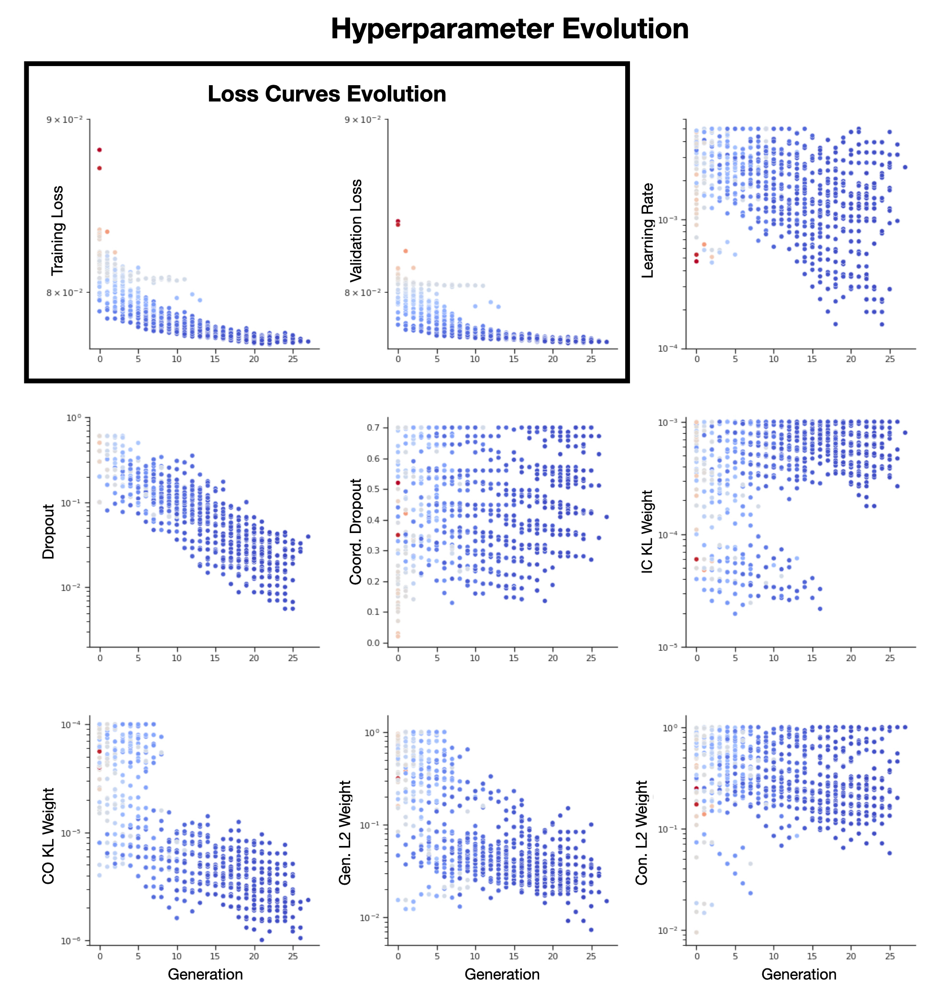

# Summary

Advances in neural interface technology are facilitating parallel, high-dimensional time series measurements of the brain in action. A powerful strategy for interpreting these measurements is to apply unsupervised learning techniques to uncover lower-dimensional latent states and descriptions of their dynamics that account for much of the variability present in the high-dimensional measurements [@cunningham2014dimensionality; @vyas2020computation; @golub2018learning]. AutoLFADS [@keshtkaran2021large] provides a novel deep learning approach for extracting estimates of these latent dynamics from neural population data. It extends the previously developed LFADS [@pandarinath2018inferring] algorithm by leveraging population based training (PBT) [jaderberg2017population] to more effectively tune hyperparameters for accurate inference of latent dynamics. As hyperparameter sweeps are a computationally demanding process, the Ray library [@moritz2018ray] was initially used to enable processing across multiple machines. Recognizing differences in tooling across teams, research supercomputing, and commercial cloud providers, we extend available workflow options to efficiently leverage AutoLFADS on new datasets in various compute environments: local development in a container-native approach, unmanaged cluster development leveraging Ray, and managed cluster development leveraging KubeFlow and Kubernetes orchestration.

As modeling strategies employed by the neurosciences increasingly employ deep learning based architectures which require optimization of large sets of hyperparameters [@keshtkaran2019enabling; @willett2021high; @yu2021fast], standardization and dissemination of computational methods becomes increasingly challenging. Although this work specifically provides an implementation using AutoLFADS, the tooling provided demonstrates strategies for employing computation at scale while facilitating dissemination and reproducibility. 

# Statement of need

Novel machine learning algorithms enable neuroscience researchers to uncover new insights on how the brain gives rise to behavior. In many cases, algorithms are developed with the intent for use across both current and future studies. However when new analysis algorithms are developed, their hyperparameters are often tuned to the datasets against which they were developed. This creates a significant barrier for new researchers and practitioners to evaluate and adopt an algorithm as they require finding suitable hyperparameters for their application. With the popularization of “AutoML” hyperparameter exploration libraries (HyperOpt, SkOpt, Ray), it is now possible to more extensively and effectively search the parameter space. Reducing the burden further and enabling scale, solutions like KubeFlow provide near codeless workflows for evaluating algorithms and tuning models end-to-end. To facilitate the effective utilization and adoption of AutoLFADS, we provide three pathways to tackle the various use-cases that will empower users with local compute, users with access to ad-hoc or unmanaged compute, and users with access to managed or cloud compute.

# Solutions

![Solutions for running AutoLFADS on various compute setups. (Left) This column depicts a local workflow: users would leverage a container image that bundles all the AutoLFADS dependencies and provides an entrypoint directly to the LFADS package. Users can interact with this workflow by providing model configurations as a YAML configuration file and command line (CLI) arguments. (Middle) This column depicts a scalable solution using Ray: users would install AutoLFADS locally or in a virtual environment, provide model configurations and hyperparameter sweep specification directly in code, and then run a script providing the cluster configuration (network location and authentication) as a YAML file. (Right) This column depicts a scalable solution using KubeFlow: users provide an experiment specification that includes model configuration and hyperparameter sweep specifications either as a YAML file or using a code-less UI-based workflow. After experiment submission, the KubeFlow service spawns workers across the cluster that use the left column container images.\label{fig:solutions}](solutions.png)

As users gain insight into novel datasets, it is often helpful to probe algorithmic parameters and investigate model performance locally. This can be accomplished by installing the LFADS package locally or in a virtual environment. Further isolating the workflow from local computational environments, we provide a pair of reference container images targeting CPU and GPU architectures where users can directly treat the image as an executable for which they simply need to provide the input neural data and desired LFADS model configuration. This approach has the benefit of eliminating the need for users to configure their environments with compatible interpreters and dependencies. Instead, the user installs a container runtime engine (e.g. Docker, Podman), which are generally well-supported cross-platform tools, to run the image based solution.

Scaling initial investigations may involve evaluating data on internal lab resources which may comprise a set of loosely connected compute devices. In such a heterogeneous environment, we leverage Ray to efficiently create processing jobs. In this approach Ray spawns a set of workers on the compute nodes that the primary spawner is then able to send jobs to. This approach requires users to provide a mapping of machine locations (e.g. IP, hostname) and access credentials. While requiring users to manage the cluster lifecycle and artifacts produced, it provides useful flexibility beyond single node local compute.

To leverage large scale compute or managed infrastructure, we use KubeFlow which is an end-to-end machine learning solution that runs on top of Kubernetes based orchestration. In this arrangement, Kubernetes manages the underlying resource pool and is able to efficiently schedule compute jobs. Within KubeFlow, we leverage Katib [@george2020katib] – KubeFlow’s “AutoML” framework – to efficiently explore the hyperparameter space and specify individual trials. Furthermore, as KubeFlow is an industry-grade tool, many cloud providers offer KubeFlow as a service or provide supported pathways for deploying a KubeFlow cluster. Once deployed, KubeFlow enables configuration-based and code-less deployment of experiments.

# Evaluation

One of the core innovations of AutoLFADS is its integration of PBT for hyperparameter exploration. Although less intensive than a full hyperparameter grid search, the depth of search is ultimately constrained by compute capacity. Thus, it is advantageous to run searches on remote compute solutions that facilitate rapid scaling. A comprehensive description of the AutoLFADs algorithm and results applying the algorithm to neural data using Ray can be found in @keshtkaran2021large. To ensure that the KubeFlow based implementation can learn models of comparable quality, we trained a model using identical PBT hyperparameters, training data, and model configurations. We demonstrate comparable exploration of hyperparameters between Ray and KubeFlow in \autoref{fig:hp_progression}, and similar converged model performances on metrics relevant to the quality of inferred latent dynamics in \autoref{fig:inferred_rates} [@pei2021neural]. This provides evidence that both implementations are converging to stable solutions given the stochastic behavior of PBT.

: AutoLFADS Performance. An evaluation of AutoLFADS performance on Ray and KubeFlow. Test trial performance comparison on four neurally relevant metrics for evaluating latent variable models: co-smoothing on held-out neurons (co-bps), hand trajectory decoding on held-out neurons (vel R2), match to peri-stimulus time histogram PSTH on held-out neurons (psth R2), forward prediction on held-in neurons (fp-bps). The trained models converge with less than 5% difference between the frameworks on the above metrics. The percent difference is calculated with respect to the Ray framework.

| Framework             | co-bps  | vel R2 | psth R2 | fp-bps |
|-----------------------|---------|--------|---------|--------|
| Ray                   | 0.3364  | 0.9097 | 0.6360  | 0.2349 |
| KubeFlow              | 0.35103 | 0.9099 | 0.6339  | 0.2405 |
| **Percent difference**    | **+4.35**   | **+0.03**  | **-0.33**   | **+2.38**  |

# References
